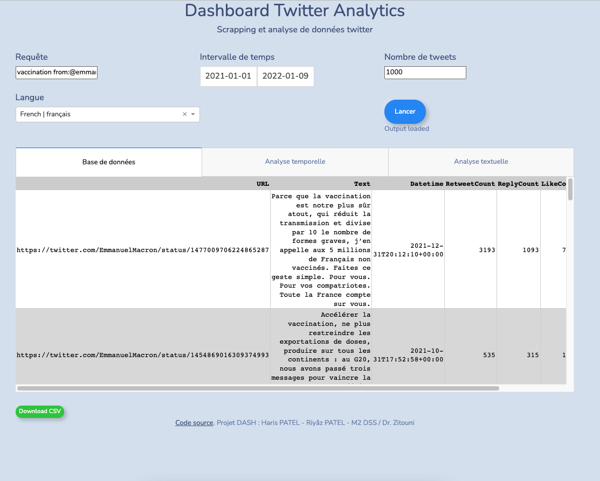
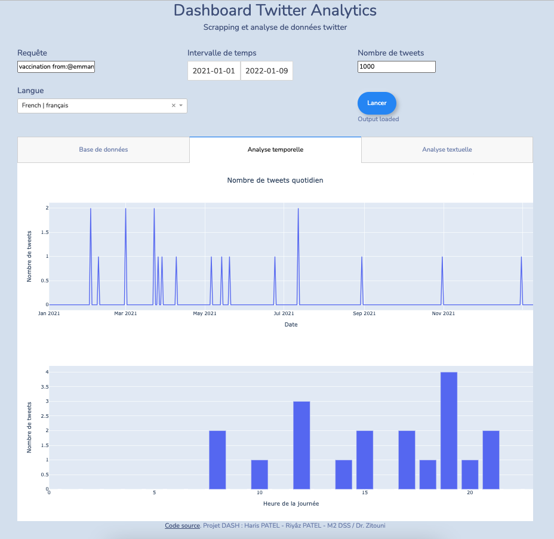
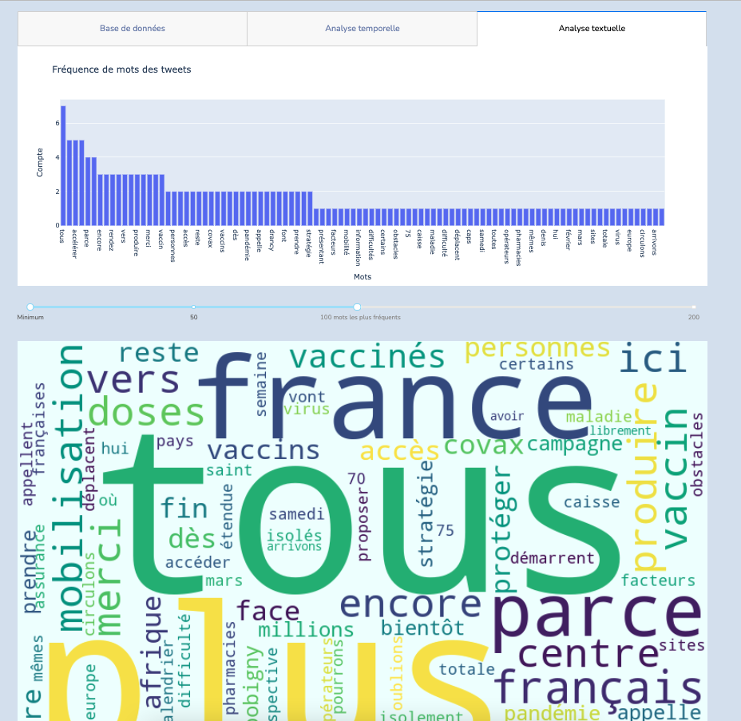
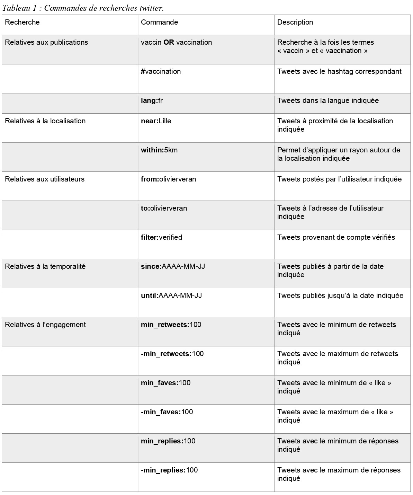

# Dash_Tw_Analytics - Projet Dash : Haris PATEL - Riyâz PATEL - M2 DSS / Dr.Zitouni 

## Présentation 

Ce git contient les fichiers nécessaire au projet Dash : Scrapping & Analyse de données Twitter.
Le dashboard, codé en Python avec Dash, permet de scrapper et d'analayser des tweets relatifs à un (ou plusieurs) mot-clé spécifié(s). 
L'exécution du script necessite la version 3.9 ou version ultérieur de python.

**Le dashboard est également accessible depuis : https://dash-ilis2022.herokuapp.com/**

Remarque : Via le site web, les requêtes trop longues (plus de 30 secondes) sont automatiquement arrêtées.
Le problème ne vient pas du tableau de bord, mais de la plateforme cloud-as-a-service Heroku. Des correctifs seront apportés pour résoudre le problème (timeout) avec l'hébergement.

Applicable dans plusieurs domaines, dont la santé, il permet :
- le Scrapping de tweets pour des dates spécifiques
- le Scrapping de tweets pour une langue spécifique
- le Scrapping de tweets pour un ou plusieurs mot-clés (cf. section "Recherche Avancées")
- la navigation dans un tableau contenant : URL du tweet, contenu, date et heure, nombre de reteweet, nombre de réponses, nombre de likes, nom d'utilisateur
- l'export au format csv de la table de la recherche

Deux analyses principales sont réalisés à partir des résultats :

- analyse temporelle : 
1. Nombre de tweets mentionnant la requête de recherche par jour
2. Habitude de publications relatives à la requête de recherche (sur toute la base de données, calcul du nombre de tweet pour chaque heure d'une journée)

- analyse textuelle :
1. Fréquence des mots relatifs aux tweets (les mots communs dit 'stopwords' sont exclus de la comptabilité)
2. Nuage de mots, relatifs aux tweets (les mots communs dit 'stopwords' sont exclus de l'affichage)

- analyse des sentiments : 
1. Pie chart de 3 catégories : positive, negative, neutre

## Recherche Avancées
La méthode de récupération de tweet est celle de Twitter, il est donc possible de faire des recherches avancées.

Il est possible de récupérer uniquement les tweets d'un utilisateur, sans préciser de mot-clé avec la requête "from:*twitter_username*".

Ci-après les principales possibilités de recherche.

L'ensemble des possibilités de recherche peut-être trouvé ici : https://github.com/igorbrigadir/twitter-advanced-search

## Référence : 
https://github.com/JustAnotherArchivist/snscrape

